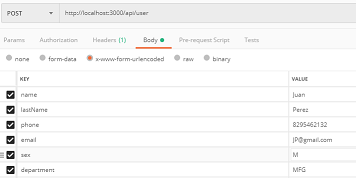

# ApiNode


## Descripción
El codigo aqui descrito es una api de NodeJs capaz de realizar las cuatro operaciones fundamentales de base de datos, que son solicitar datos(**get**), agregar nuevos datos(**post**), actualizar datos(**put**) y eliminarlos(**delete**).

---
## Dependencias
- Nodejs
    - Express
    - Mongoose
    - Body-parser
    - Nodemon
---    
## Software
- Editor de codigo: **Visual Studio Code.**  
- Gestor de base de datos: **MongoDB.**
- Genrerador de consultas: **Postman.**
---
## Estructura
- Controllers
    - coment.js: En este archivo se encuentran las funciones necesarias para gestionar los comentarios.
    - deparment.js: En este archivo se encuentran las funciones necesarias para gestionar los departamentos.
    - user.js: En este archivo se encuentran las funciones necesarias para gestionar los usuarios.   
 - Models
    - coment.js: en este archivo se establece el modelo de datos para los comentarios.
    - department.js: en este archivo se establece el modelo de datos para los departamentos.
    - user.js: en este archivo se establece el modelo de datos para los usuarios.
- Routes
    - index.js: En este archivo gestionan todas las rutas de nuestra aplicación.
- Config.js
- index.js
- package.json

---
## Instrucciones de arranque

1. Arrancar la base de datos: Abrir una consola de comandos y escribir el comando :
```
mongod
```
2. Arrancar el servidor: En una nueva consola de comandos escribir el comando :
```
npm run dev
```
3. Una vez arrancados ambos la consola arrojara lo siguiente:
```
conexion a la base de datos establecida
Servidor corriendo en el puerto: 3000
```
4. Tomamos el numero de puerto y escribimos en el navegador  [Click aqui](http://localhost:3000/api/user).

5. Esto nos llevar a una pagina que nos mostrara los usuarios registrados en forma de objeto json.
---
## Intrucciones para insertar datos
1. Abrimos el programa Postman.
2. Generamos una consulta
- 
3. Volvemos al navegador y revisamos que el usuario se haya agregado correctamente.
---
